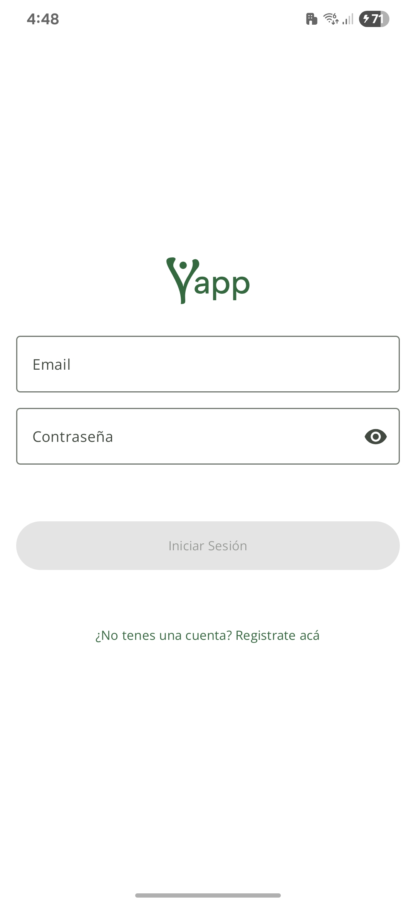
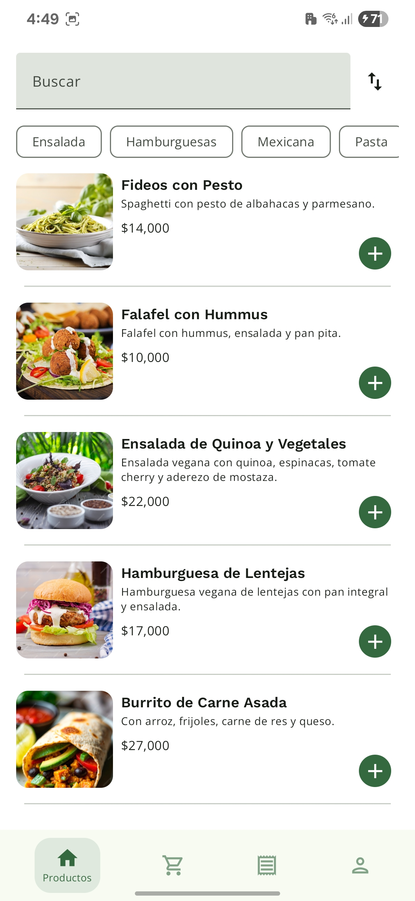
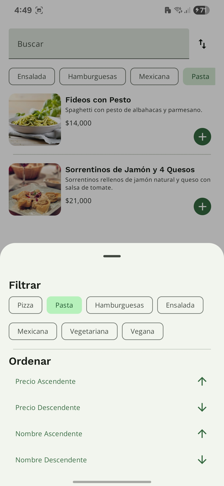
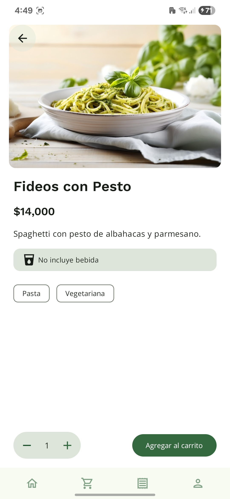
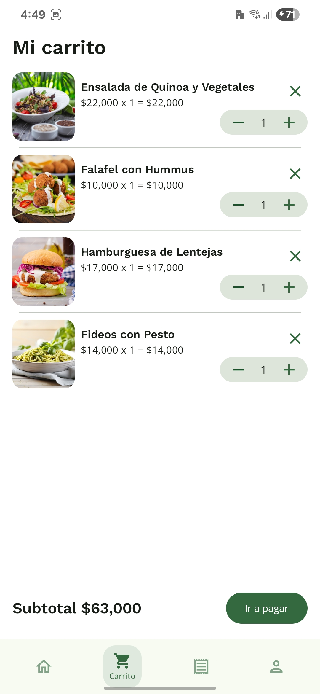
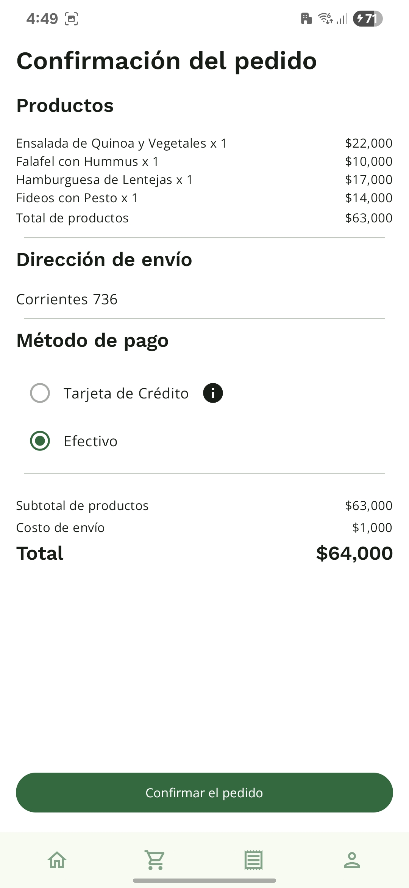
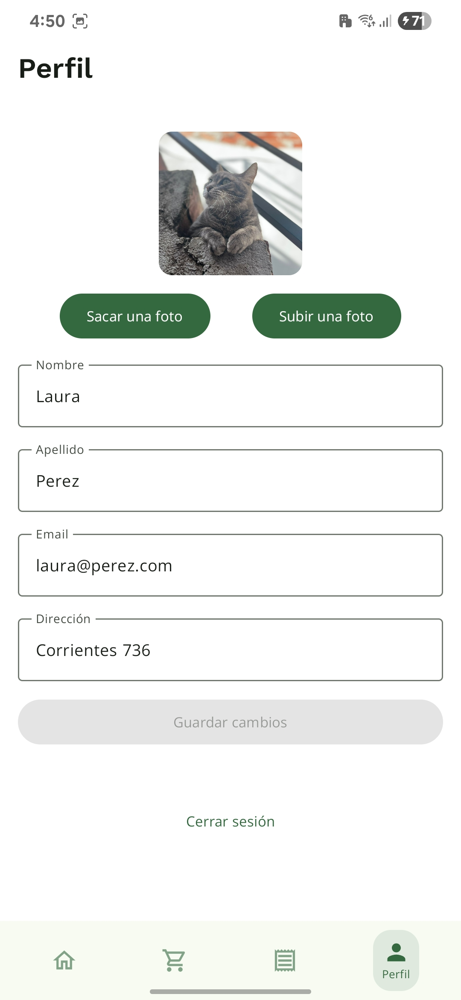
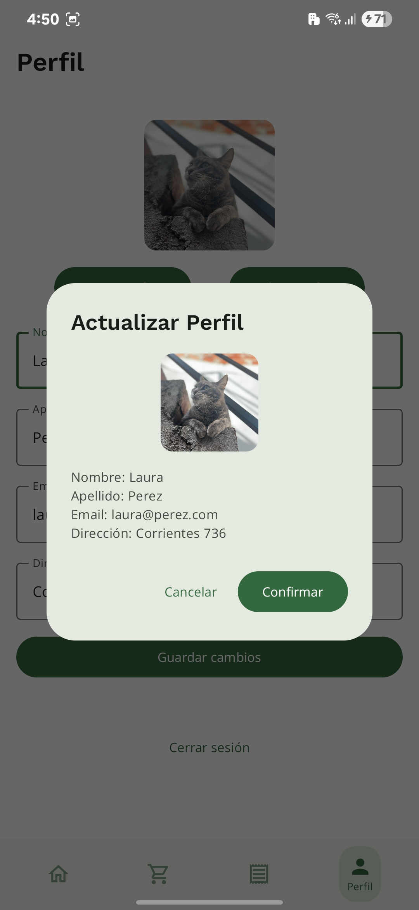

# Yapp

Aplicacion desarrollada en Kotlin para Android, utilizando MVVM, Hilt, Room y Retrofit.

  
  
  
  

  
  
  
  

## Funcionalidades principales

- Gestión de usuarios sincronizados con una API alojada en Render.
- Listado de productos con filtrado por categorías, búsqueda y ordenamiento.
- Detalle del producto con información completa.
- Carrito de compras sincronizado en Room.
- Checkout del pedido.
- Historial de pedidos.
- Gestión de perfil de usuario con sincronización en la API y subida de imágenes a Cloudinary.

## Tech Stack

- Kotlin para desarrollo de Android
- Hilt para inyección de dependencias
- Retrofit & Gson para consumo de API REST
- Coil para carga de imágenes
- Material Components y Jetpack Compose

## Arquitectura y patrones de diseño
Arquitectura general: MVVM + Clean Architecture + State Hoisting.
- **MVVM**: Modelo-Vista-ViewModel, separa la lógica de negocio de la UI.
- **Clean Architecture**: Estructura modularizada en capas para una mejor mantenibilidad y testabilidad.
- **State Hoisting**: Manejo del estado de la UI de forma declarativa, permitiendo una mejor gestión de los estados y eventos.

Gestión de estados y eventos:
- **StateFlow**: Utilizado para manejar el estado de la UI de forma reactiva.
- **LaunchEffect**: Para manejar efectos secundarios y eventos únicos en la UI.

Gestión de dependencias:
Se utiliza Hilt para la inyección de dependencias, facilitando la gestión de instancias y la modularización del código.
Las dependencias fluyen hacia abajo, desde el módulo de presentación, pasando por el módulo de dominio y hasta el de datos, asegurando una separación clara de responsabilidades.

## Modularización
La aplicación está estructurada en módulos para una mejor organización y reutilización del código:
- **app**: Módulo principal que contiene la configuración de la aplicación y la navegación.
- **core**: Módulo de utilidades y extensiones comunes utilizadas en toda la aplicación.
  - **data**: Módulo de acceso a datos, incluyendo la implementación de Room y Retrofit.
    - datasource: Fuentes de datos, como bases de datos locales y servicios web.
    - repository: Repositorios que gestionan la lógica de acceso a datos y la sincronización entre fuentes.
    - di: Inyección de dependencias para el acceso a datos.
  - **domain**: Módulo de lógica de negocio, contiene los casos de uso.
  - **model**: Módulo de modelos de datos, define las estructuras de datos utilizadas en la aplicación.
  - **navigation**: Módulo de navegación, define las rutas y la navegación entre pantallas.
- **:feature**: Módulos de características específicas de la app.
  - :feature:cart: Módulo de gestión del carrito de compras.
  - :feature:checkout: Módulo de gestión del proceso de checkout.
  - :feature:productlist: Módulo de gestión de productos, incluyendo el listado y detalle.
  - :feature:profile: Módulo de gestión del perfil de usuario.
  - :feature:order: Módulo de gestión de pedidos y su historial.
  - :feature:login: Módulo de autenticación y gestión de usuarios.
  - :feature:signup: Módulo de registro de usuarios.
- **utils**: Módulo de utilidades y extensiones comunes utilizadas en toda la aplicación.

## Navegación

La navegación se gestiona mediante **JetPack Compose Navigation**.

La autenticación del usuario es requisito previo para acceder a las funcionalidades principales.

En caso de éxito, navega a Product List Screen eliminando la pantalla de login del Back Stack con `popUpTo(NavigationRoutes.LOGIN) { inclusive = true }`

Una vez iniciada la sesión, la navegación se maneja principalmente a través de la Bottom Bar.

Hay tres excepciones, una es que si el carrito está vacío, se muestra una pantalla específica con un botón que deriva nuevamente a la Products List. 
La otra es en el caso de estar en el carrito, se puede ir a la pantalla de Checkout unicamente desde ahi.
Si queremos avanzar a checkout y el usuario no tiene una dirección de envío configurada, se muestra un mensaje de error y se redirige a la pantalla de perfil para que el usuario pueda configurarla.
Una vez confirmado el pedido, nos deriva automaticamente a la pantalla de OrderHistory ( a través de un `LaunchedEffect` que observa el estado `orderConfirmed`)